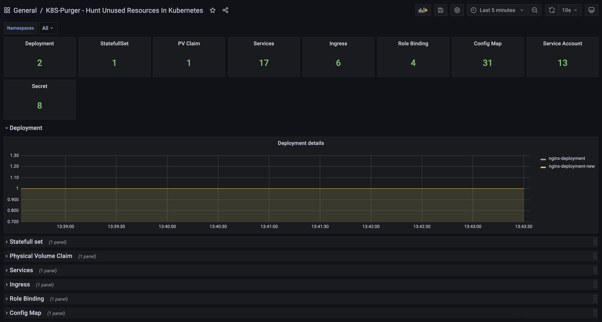

<!--
Licensed to the Apache Software Foundation (ASF) under one
or more contributor license agreements.  See the NOTICE file
distributed with this work for additional information
regarding copyright ownership.  The ASF licenses this file
to you under the Apache License, Version 2.0 (the
"License"); you may not use this file except in compliance
with the License.  You may obtain a copy of the License at

  http://www.apache.org/licenses/LICENSE-2.0

Unless required by applicable law or agreed to in writing,
software distributed under the License is distributed on an
"AS IS" BASIS, WITHOUT WARRANTIES OR CONDITIONS OF ANY
KIND, either express or implied.  See the License for the
specific language governing permissions and limitations
under the License.
-->

# Installation and Configuration

There are two ways we can run this utility. In kubernets as services and as ad-hoc.


## Installing in Kubernetes as services

Deploying in Kubernetes itself which will run periodically (every 15 minutes by default) and capture unused resources and expose them as Prometheus metrics. You should configure prometheus or similer tool to scrape this metrics 

Once you have all The metrics in promethius you can configure prometheus rule to trigger alert. Sample alert are provided in deploy folder deploy/prometheusrule.yaml(./deploy/prometheusrule.yaml)

And you can import k8sPurger Dashboard from deploy folder to create dashbaord like below.



NOTE :- Service will scan for unused resources every 15 minutes which you can changing by setting REFRESH_INTERVAL(in second) in deployment.yaml

```
git clone https://github.com/yogeshkk/K8sPurger
cd K8sPurger
kubectl apply -f deploy/manifest.yaml
```


##  Running From shell 

Second way is to run as ad-hoc command as and when required. You can run this manually it required [Python client for Kuberntes](https://github.com/kubernetes-client/python). We need to install that first also make sure you have kubeconfig in ~/.kube/conf or in KUBECONFIG env variable before runing script.

```
pip install kubernetes
python K8sPurger.py
```

Output Will look like below
```

yogesh$ ~/p/K8sPurger> python K8sPurger.py

This script is created to find unused resource in Kubernetes.

Getting unused secret it may take couple of minute..

Extra Secrets are 6 which are as below

--------------------------------
| Secrets         | Namespace   |
--------------------------------
| app1-secret     | my-apps     |
| app2-secret     | my-apps     |
| app2-new-secret | my-apps     |
| postgresql      | default     |
| dex-b94455424g  | kube-addons |
| dex-dbh8fmk699  | kube-addons |
--------------------------------

Getting unused ConfigMap it may take couple of minute..

Extra ConfigMap are 6 which are as below

-------------------------------------------
| ConfigMap                 | Namespace   |
-------------------------------------------
| app1-configmap            | my-apps     |
| app2-configmap            | my-apps     |
| app2-new-configmap        | my-apps     |
| ss-cm                     | default     |
| cluster-autoscaler-status | kube-addons |
| fluent-bit-config         | logging     |
-------------------------------------------

Getting unused PVC it may take couple of minute..

Extra PV Claim are 5 which are as below
---------------------------------
| PV Claim          | Namespace |
---------------------------------
| data-postgresql-0 | default   |
| data-0            | default   |
| redis-master-0    | default   |
| redis-slave-0     | default   |
| redis-slave-1     | default   |
--------------------------------

Getting unused services it may take couple of minute..

Extra Services are 3 which are as below

-----------------------------
| Services      | Namespace |
-----------------------------
| app1-services | my-apps   |
| app2-services | my-apps   |
| app2-headless | my-apps   |
-----------------------------

Getting unused Ingress it may take couple of minute..

Extra Ingress are 4 which are as below

----------------------------------------
| Ingress                  | Namespace |
----------------------------------------
| app1-ingress             | my-apps   |
| app2-ingress             | my-apps   |
| app2-ingress-api-gateway | my-apps   |
| router                   |default    |
----------------------------------------

Getting unused service account it may take couple of minute..

Extra Service Account are 6 which are as below
----------------------------------
| Service Account | Namespace    |
----------------------------------
| app1-svc        | my-apps      |
| cert-svc        | cert-manager |
| log-svc         | logging      |
| monitor-svc     | monitoring   |
| default         | my-registry  |
| default         | tools        |
----------------------------------

Getting unused Roles Binding it may take couple of minute..

Extra Role Binding are 1 which are as below

---------------------------
| Role Binding |Namespace |
---------------------------
| app1-rb      |my-apps   |
---------------------------


Extra Deployment are 1 which are as below

--------------------------------
| Deployment         |Namespace |
--------------------------------
| busybox-deployment |default   |
--------------------------------
 

Extra Stateful Sets are 1 which are as below

----------------------------
| Stateful Sets  |Namespace |
----------------------------
| nginx-sts-test |default   |
----------------------------

```

  

### NOTE:- You can browse code and if like idea provides star for encouragement or provide feedback to me one below social networks.

Twitter https://twitter.com/yogeshkunjir LinkedIn https://www.linkedin.com/in/yogeshkunjir/

<a href='https://ko-fi.com/yogeshkunjir' target='_blank'>
